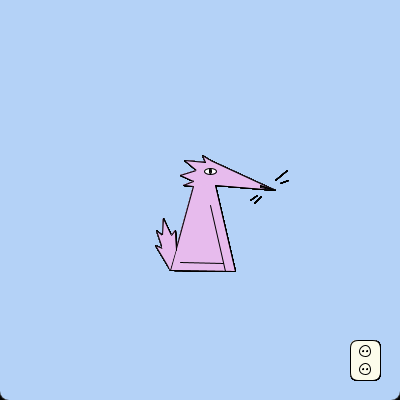

One of my first programming projects was creating this animal-like creature. It was made in Processing, a Java-based language designed for visual arts and interactive media. I built the creature entirely out of geometric shapes and lines, drawing inspiration from a riso-printed drawing I had made earlier.
<single-image src="_creains.jpg" height="3000" width="500" caption="Reference drawing">

When you click on the wall socket, the creature gets "electrocuted": his whiskers get spikey.

