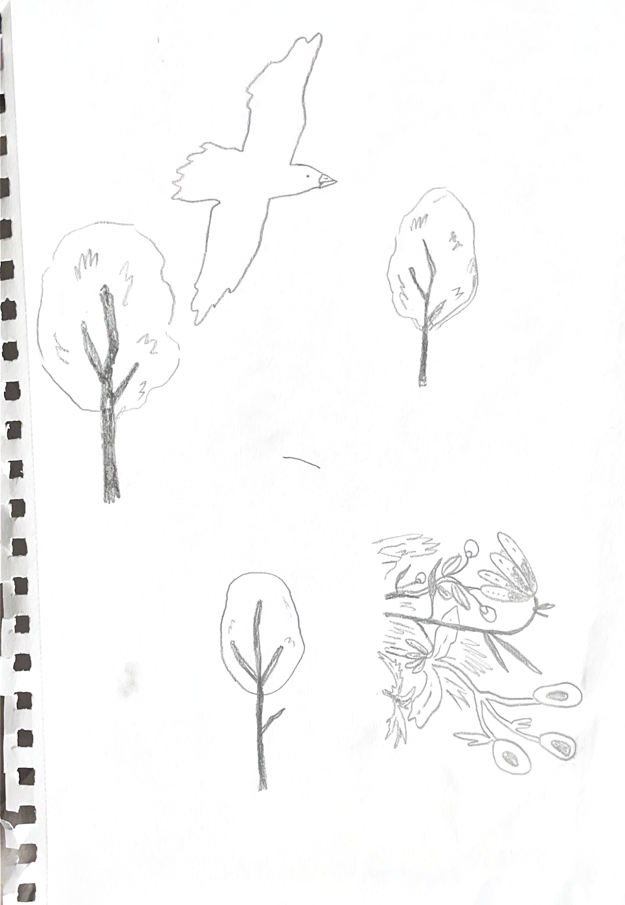

I developed a paper-airplane game in Processing, a Java-based language designed for visual arts and interactive media. The game incorporates concepts such as flocking, forces and randomness. In this game, the goal is to guide a flock of migrating birds safely to their destination using a paper airplane. The player launches the airplane with a catapult and then controls the ‘wind’ using their mouse. When the paper airplane hits the ground, the player starts over with the catapult again.

The paper plane flies through a landscape featuring a looping background, along with randomly placed and sized trees and flowers. To create a relaxing experience for players, I chose a minimal design with soft pastel colors. I drew all the images by hand and then scanned them digitally to create the game's visuals.

